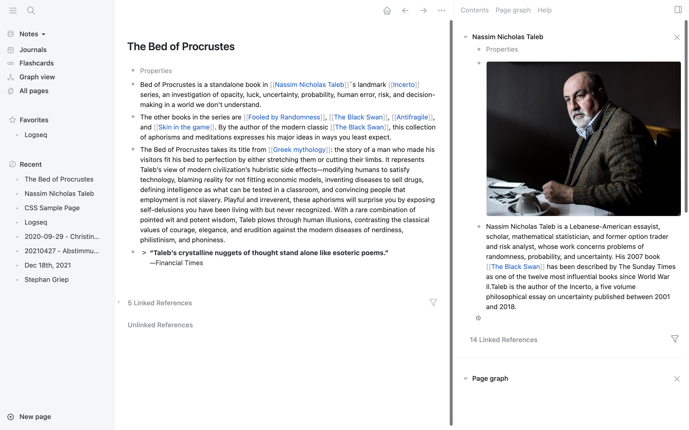
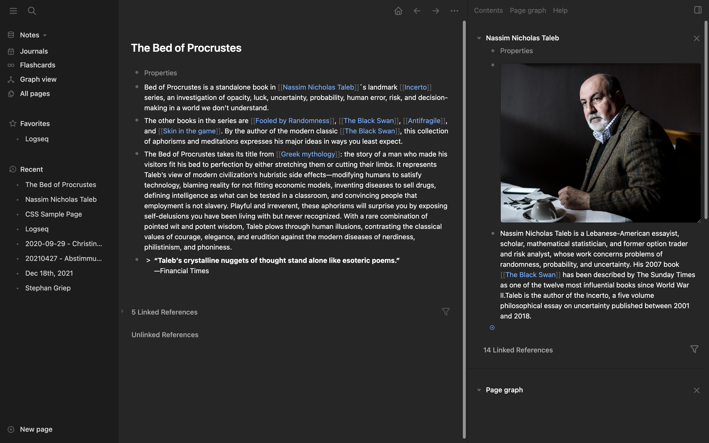

# The Logseq CSS System

## What is it?
The Logseq CSS System is a modular, block-based approach for changing the look and feel of [Logseq](https://logseq.com). It has been thoughtfully engineered to allow easy customization by the non-tech-affine end user and offers different minimal, beautiful designed elegant themes.

## If you want to support my work

- [Buy Me a Coffee](https://www.buymeacoffee.com/rcvdio)
- [Become a supporter on gödel.io](https://www.goedel.io/subscribe?utm_medium=web&utm_source=subscribe-widget&utm_content=47299057)
- [Flattr](https://flattr.com/@rcvd)
- [Paypal](https://paypal.me/rcvd)

Thanks a lot for your support!

## How to install the themes
Install them from the Logseq marketplace or load them manually by adding somthing like

    @import url('https://rcvd.github.io/logseq-css-system/output/bear.css');
    
to your `custom.css`. Replace `bear.css` with `craft.css`, `quattro.css` or `things.css` if you want one of the other themes.

## Screenshots
### Bear

### Craft

### Quattro

### Things

## Bugs and feedback
- If you find a bug, file it under Issues with a short description and an screenshot
- If you want to discuss an issue contact me on [Twitter](https://twitter.com/rcvd_io) or drop me an email to logseq (at) rcvd (dot) io
